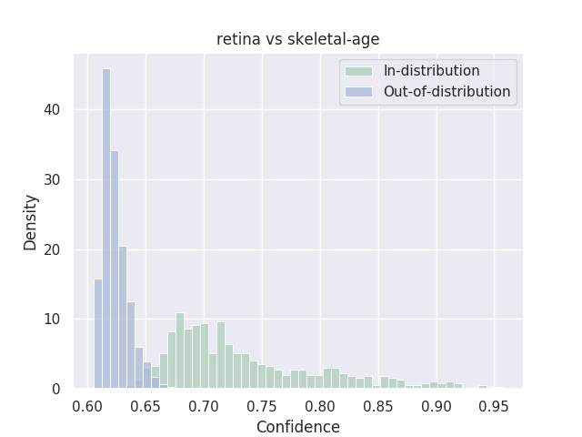
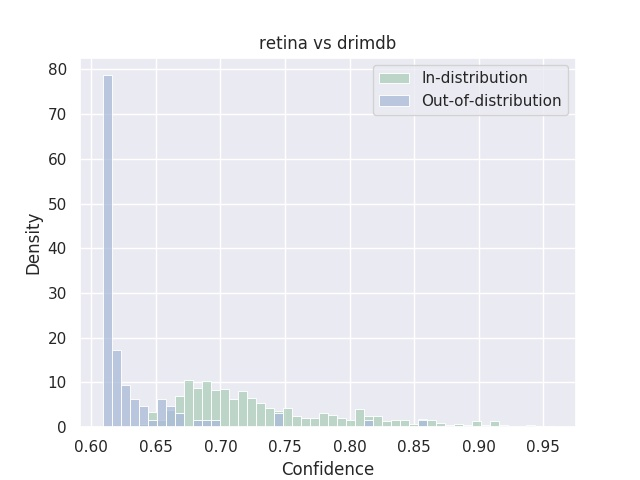
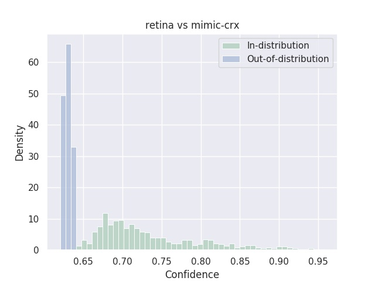
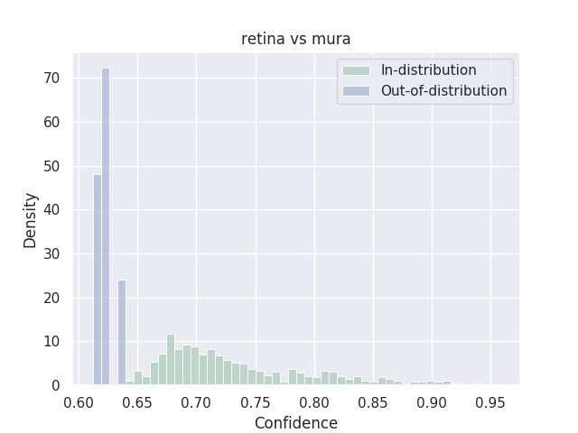
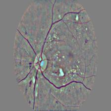
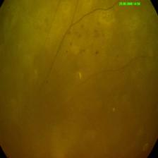
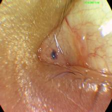
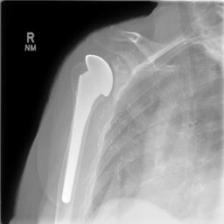

## Out-of-distribution detection for medical imaging

This repository replicates some of the results presented in the paper.

We provide the full set of data for the [Diabetic Retinopathy](https://www.kaggle.com/c/diabetic-retinopathy-detection/data), [drimdb](http://isbb.ktu.edu.tr/multimedia/drimdb/) and [RNSA BoneAge](https://www.kaggle.com/kmader/rsna-bone-age) datasets as they are publicly available for download. 

For the [MIMIC-CRX](https://physionet.org/content/mimic-cxr/2.0.0/) and [MURA](https://stanfordmlgroup.github.io/competitions/mura/) datasets, please refer to the authors webpage to get access. In the scope of this repository, we only give access to ten samples for these two datasets in order to print some test results.

### Data

Download the data from this [link](https://drive.google.com/file/d/1oY1Ey8ttwh7eufx2EWf0jQj1LhXIbgBu/view?usp=sharing).
Unzip the archive in the data folder.

### Train a model

To train a model, one can use the following command:
```
python train.py --experiment_name=baseline \
--idd_name retina --ood_name mimic-crx skeletal-age mura drimdb \
--use_hint True --hint_rate=0.5 --lmbda=0.5 --batch_size 64 \
--network resnet50 --mode devries --early_stop_metric fpr_at_95_tpr --eval_start 10 --use_scheduler True
```
The in-domain dataset is the Diabetic Retinopathy dataset and we select all the others as OOD. We use hint of probability ```0.5``` and lambda hyperparameters as ```0.5```. The early-stop metric chosen is ```fpr_at_95_tpr```.  We use the confidence branch (```--mode devries```)

A pretrained model of this version can be download [here](https://drive.google.com/file/d/1uxsNyknFCO2E6WUWWVHOWcRCdZUN54tL/view?usp=sharing).

### Test a model

Using the pretrained model, you can print results using this command:
```
python test.py --ckpt checkpoints/devries/ood_retina_model_0.03275.pth \
--idd_name retina --ood_name mimic-crx skeletal-age mura drimdb \
--network resnet50
```
and expect the following ouput:
```
Accuracy 0.4396
OOD Metrics {'fpr_at_95_tpr': 0.0, 'detection_error': 0.0, 'auroc': 1.0, 'aupr_in': 1.0, 'aupr_out': 0.979, 'num_95_tpr': 4, 'OOD Name': 'mimic-crx'}
{'fpr_at_95_tpr': 0.01, 'detection_error': 0.015, 'auroc': 0.997, 'aupr_in': 0.985, 'aupr_out': 0.999, 'num_95_tpr': 76, 'OOD Name': 'skeletal-age'}
{'fpr_at_95_tpr': 0.0, 'detection_error': 0.0, 'auroc': 0.999, 'aupr_in': 1.0, 'aupr_out': 0.955, 'num_95_tpr': 4, 'OOD Name': 'mura'}
{'fpr_at_95_tpr': 0.121, 'detection_error': 0.11, 'auroc': 0.951, 'aupr_in': 0.985, 'aupr_out': 0.915, 'num_95_tpr': 16, 'OOD Name': 'drimdb'}
Dumping outputs in checkpoints/baseline
retina max conf 0.96 min conf 0.63
mimic-crx max conf 0.64 min conf 0.62
skeletal-age max conf 0.7 min conf 0.6
mura max conf 0.64 min conf 0.61
drimdb max conf 0.85 min conf 0.61
```
Images and plots and dumped in the ```checkpoints/devries``` folder.
Here are samples of these outputs:

<table class="tg">
<thead>
  <tr>
    <th align="center" colspan="4">Histograms</th>
  </tr>
</thead>
<tbody>
  <tr>
    <td class="tg-0pky"></td>
    <td class="tg-0pky"></td>
    <td class="tg-0pky"></td>
    <td class="tg-0pky"></td>
  </tr>
</tbody>
</table>


<table class="tg">
<thead>
  <tr>
    <th align="center" colspan="4">Confidence bounds</th>
  </tr>
</thead>
<tbody>
  <tr>
    <td class="tg-0pky"></td>
    <td class="tg-0pky"></td>
    <td class="tg-0pky"></td>
    <td class="tg-0pky"></td>
  </tr>
    <tr>
    <td class="tg-0pky">Confidence:0.96</td>
    <td class="tg-0pky">Drimdb:0.61</td>
    <td class="tg-0pky">Drimdb:0.85</td>
    <td class="tg-0pky">MURA:0.61</td>
  </tr>
  
</tbody>
</table>


